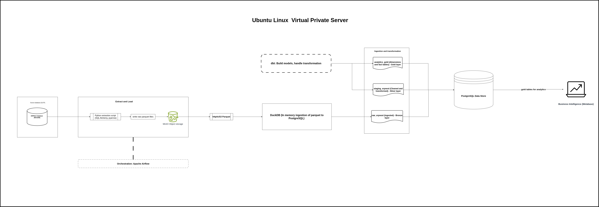

# Modernizing ERP analytics using ELT Architecture

## Overview
ERP systems handle transactional workloads such as creating sales orders, purchase orders, sales invoices, delivery notes, Bill Of Materials, Work orders, stock entries, updating accounts and inventory.  These transactions aggregate over time.
As the volume of transactions continue to grow from hundreds of thousands of rows to millions of rows, direct BI connection to the operational database becomes leads to performance and limited scalability.

The increasing volume of data and complexity of analytics leads to performance bottlenecks in the OLTP database, and suboptimal query performance. 
Furthermore, operational databases such as MariaDB (MySQL) used by ERPNext are meant for OLTP functions and not optimized for OLAP functions.

This is where data engineering comes in by designing and maintaining data pipelines that extract, load and transform the data from the source OLTP database
into optimized datawarehouse. By spliting the OLTP and OLAP functions, we are able to opimize data workflows, transform and aggregate data for analytical tasks 
effectively without affecting the OLAP functions.

## Architecture Overview



## Project setup
Installing pip, virtual env, postgreSQL and MariaDB dependencies

```
sudo apt update && sudo apt upgrade -y
```

```
sudo apt install -y python3 python3-venv python3-pip python3-dev build-essential lipq-dev default-libmysqlclient-dev pkg-config curl wget git
```

